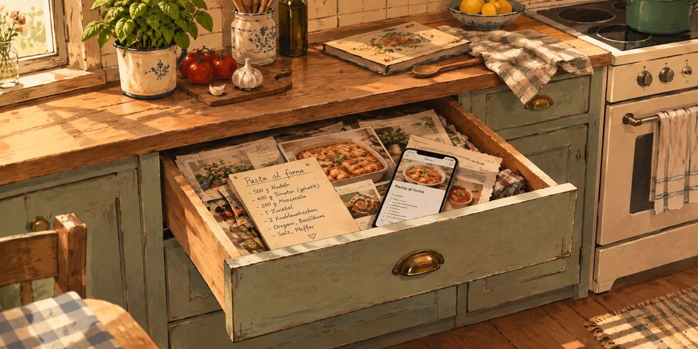

**Recipe Drawer**



Self-hosted recipe book with AI-powered import from websites and screenshots, built with FastAPI, HTMX and SQLite.

> **Status:** early-stage portfolio project. So far there's only a health check and a
> placeholder start page - recipe import isn't built yet.

See the [project plan](docs/plan.md) for requirements, architecture and decisions.

Licensed under [MIT](LICENSE).

## Setup

All commands below are identical on Windows (PowerShell), macOS and Linux unless
noted otherwise - none of them rely on shell-specific syntax.

### Prerequisites

- [uv](https://docs.astral.sh/uv/) – manages the Python version and dependencies; no separate Python install needed.
- [Docker](https://www.docker.com/) – only needed to run the app in a container. Docker Desktop
  must be running before `docker build`/`docker run` will work.

### Clone and install

```bash
git clone https://github.com/alina-geissler/recipe-drawer.git
cd recipe-drawer
uv sync
```

`uv sync` creates a virtual environment and installs all dependencies pinned in `uv.lock`, including dev tools (Ruff, mypy, pytest, pre-commit).

### Run the app

```bash
uv run uvicorn app.main:app --reload
```

Open <http://127.0.0.1:8000> in a browser. `--reload` restarts the server automatically on code changes.

### Run tests and checks

```bash
uv run pytest
uv run ruff check .
uv run ruff format --check .
uv run mypy .
```

### Pre-commit hooks

```bash
uv run pre-commit install
```

Run once after cloning. Installs git hooks that run Ruff and mypy automatically before every commit.

### Run with Docker

```bash
docker build -t recipe-drawer .
docker run -d --name recipe-drawer -p 8000:8000 recipe-drawer
```

Open <http://localhost:8000>. Stop and remove the container afterward:

```bash
docker stop recipe-drawer
docker rm recipe-drawer
```