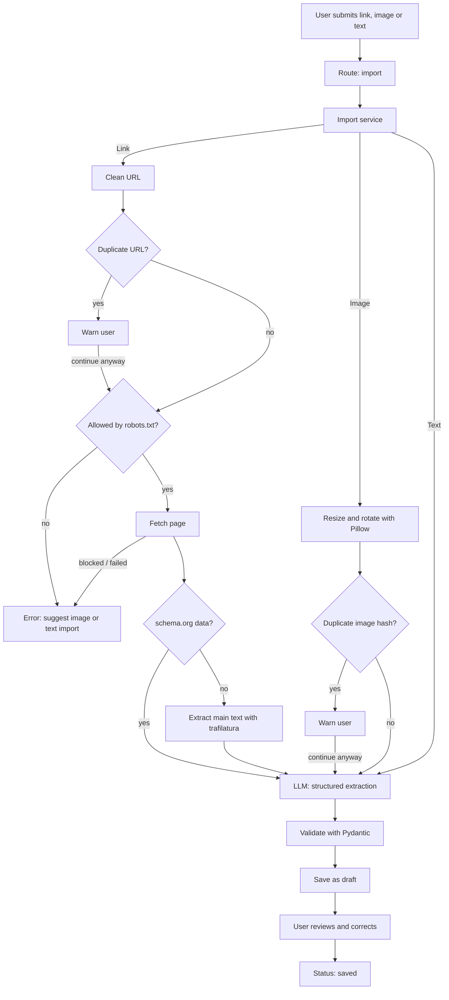
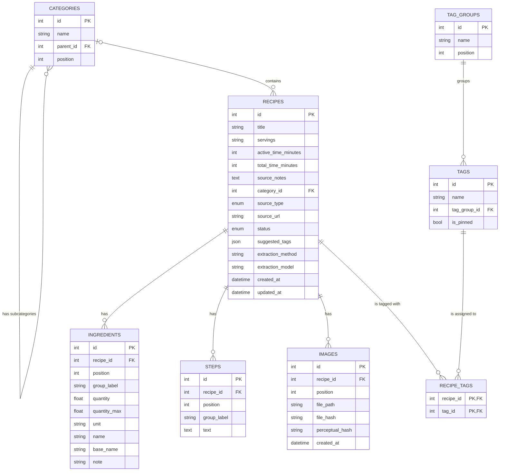

# Project Plan: Recipe Drawer

**Status:** Active · **Last updated:** 2026-09-29

---

## 1. Overview

### 1.1 Problem
I have a drawer full of (mostly handwritten) recipes, countless open tabs with recipes and lots of screenshots with even more recipes. It’s impossible to find a specific one, or to look through different recipes in a category to choose one.

### 1.2 Goal
The app should be able to accept recipes in the form of a link, an image or free text, extract the recipe and present it clearly with ingredients and preparation steps – just like on a recipe blog. With various filter and search options, you can find suitable recipes quickly and easily.

### 1.3 Target Audience
First and foremost, I’d like to use the app myself, and also make it available as open source.

### 1.4 Non-goals
- No public recipe platform: Recipes are not published or shared with others; the recipe book is private.
- No bypassing of access restrictions: Pages that block access via robots.txt or bot protection are not automatically imported.
- No import from social media: Instagram, TikTok, Facebook and videos are not supported; screenshots can be used instead.
- No automatic web scraping: Only content specifically submitted by the user is imported; there is no crawling or bulk import.
- No native mobile app: The service is accessed via a mobile browser.
- No AI-generated recipes: The AI extracts and organises information, but does not invent recipes.

---

## 2. Requirements

### 2.1 User Stories

| ID    | User Story                                                                                                                                                                                                            | Priority |
|-------|-----------------------------------------------------------------------------------------------------------------------------------------------------------------------------------------------------------------------|----------|
| US-01 | As a user, I want to import a recipe by pasting a link to a recipe page, so that it is added to my recipe book without retyping it.                                                                                   | Must     |
| US-02 | As a user, I want to import a recipe by uploading a screenshot or photo, so that I can save recipes from cookbooks, handwritten notes, apps or social media.                                                          | Must     |
| US-03 | As a user, I want to import a recipe by pasting its text, so that I can save recipes from sources that cannot be imported automatically.                                                                              | Must     |
| US-04 | As a user, I want to view each recipe in a clear, blog-like layout (title, image, ingredients, instructions, source), so that I can easily cook from it.                                                              | Must     |
| US-05 | As a user, I want to search my recipes by keywords matching their title and tags, so that I can quickly find a specific recipe.                                                                                       | Must     |
| US-06 | As a user, I want to filter my recipes by various criteria, so that I can narrow down my collection.                                                                                                                  | Must     |
| US-07 | As a user, I want to browse my recipes by categories and subcategories (e.g. sweet → baking), so that I can explore my collection without searching.                                                                  | Must     |
| US-08 | As a user, I want to review and correct an extracted recipe before saving it, so that errors from the AI extraction do not end up in my recipe book.                                                                  | Must     |
| US-09 | As a user, I want to edit and delete saved recipes, so that I can keep my recipe book up to date.                                                                                                                     | Must     |
| US-10 | As a user, I want to mark recipes as my own, as already tried and as favourites, so that I can tell tested favourites apart from recipes I still want to try and find them quickly.                                   | Should   |
| US-11 | As a user, I want to add personal notes to a recipe, so that I can record my experiences and adjustments.                                                                                                             | Should   |
| US-12 | As a user, I want to be warned when I import a recipe or try to save a title that is already in my recipe book, so that I don't end up with duplicates.                                                               | Should   |
| US-13 | As a user, I want to search by meaning (e.g. "something quick with chickpeas"), so that I find matching recipes even without exact keywords.                                                                          | Should   |
| US-14 | As a user, I want to create a recipe manually by filling in a structured form, so that I can add recipes without AI extraction (e.g. family recipes).                                                                 | Should   |
| US-15 | As a user, I want to upload my own photos to a recipe, so that I can document my version of the dish.                                                                                                                 | Could    |
| US-16 | As a user, I want to import a recipe from a PDF file, so that I can add recipes I have stored as PDFs (e.g. downloaded recipe cards or web pages saved as PDF).                                                       | Could    |
| US-17 | As a user, I want to export a recipe as a PDF, so that I can print it or share it with others.                                                                                                                        | Could    |
| US-18 | As a user, I want to create variants of a recipe (e.g. vegan or with added seeds), so that I can keep related versions together instead of saving them as separate recipes.                                           | Could    |
| US-19 | As a user, I want to select several recipes and compare their ingredients side by side, so that I can create my own version and save it with references to the original recipes.                                      | Could    |
| US-20 | As a user, I want to develop a recipe further by creating a new numbered version instead of overwriting it, so that the latest version is shown by default while I can still browse and compare the earlier versions. | Could    |


### 2.2 Non-functional Requirements
Legal & Fairness
- The robots.txt file is checked before each request; prohibited pages are not imported. 
- Access protection measures, such as bot detection, are not circumvented; instead, image or
  text import is suggested. 
- Retrievals are carried out using a genuine, unique user agent. 
- Only freely accessible pages; only links specifically provided by the user. 
- The source URL is stored and displayed for every imported recipe. 
- No third-party content in the public repository or in a public demo.

Security 
- The app is not publicly accessible on the internet; access is only possible via the home network or via a VPN.
- Login details and API keys are never included in the code or in the public repository (see Section 11 for implementation details).

Data Security & Reliability (see NFR-08, NFR-09, NFR-10)
- Regular, consistent backups of the database and images to the NAS. 
- Restoration from a backup has been tested. 
- The active database is not stored on a network share.

Costs (see NFR-01, NFR-02)
- The most cost-effective model that meets the quality targets for extraction (see ‘Quality of extraction’) is used for the extraction. 
  The selection is made by comparing several models using the same test data.
- The LLM is only used where necessary (structured schema.org data first). 
- Images are resized before sending to save tokens. 
- Token usage per import is recorded.

Quality of Extraction (see NFR-03, NFR-04)
- The AI reproduces content exactly as it is and does not invent anything. 
- Each extracted recipe is checked by the user before being saved. 
- The extraction success rate is measured using test data.

Robustness & Error Handling 
- Tracking parameters are removed from URLs before they are retrieved. 
- Failures result in clear, accurate messages rather than misleading ones.

Usability (see NFR-12)
- The interface is easy to use on a mobile phone and easy to read whilst cooking. 
- Photos can be taken directly on the mobile phone using the camera.

Maintainability & Portability
- The app runs in a Docker container and can therefore be run on any host; the target environment is my own NAS.
- Settings are configured via environment variables. 
- The LLM provider is interchangeable. 
- Images are stored as files; the storage location can be changed later.

Storage (see NFR-11)
- Images are stored in a compressed format.

Performance (see NFR-05, NFR-6, NFR-07)
- Imports and searches respond fast enough for everyday use.

Release 
- The code is open source and can be self-hosted by others.

#### Measurable Targets

> **Note:** All target values are provisional. They are based on the feasibility spike and will
> be validated during the model evaluation (see milestone M5), which takes place once the
> extraction module is implemented. Changes to target values are recorded in the decision log
> (section 16).

| ID     | Category           | Requirement                                             | Target                                                     | Verification                                                             | Status      |
|--------|--------------------|---------------------------------------------------------|------------------------------------------------------------|--------------------------------------------------------------------------|-------------|
| NFR-01 | Cost               | Average LLM cost per import                             | ≤ €0.005 (0.5 euro cents)                                  | Token usage from API responses, averaged over the test set               | Provisional |
| NFR-02 | Cost               | The cheapest model that meets NFR-03 and NFR-04 is used | –                                                          | Model comparison on the test set                                         | TBD         |
| NFR-03 | Extraction quality | Link imports without critical errors                    | ≥ 95 %                                                     | Evaluation on test set (≥ 20 links), error definitions see section 10.2  | Provisional |
| NFR-04 | Extraction quality | Image imports without critical errors                   | ≥ 85 %                                                     | Evaluation on test set (≥ 20 images), error definitions see section 10.2 | Provisional |
| NFR-05 | Performance        | Duration of a link import                               | 95 % of link imports complete within 15 s                  | Measured during evaluation                                               | Provisional |
| NFR-06 | Performance        | Duration of an image import                             | 95 % of image imports complete within 15 s                 | Measured during evaluation                                               | Provisional |
| NFR-07 | Performance        | Search results response time                            | Keyword search and filter results are displayed within 1 s | Measured with realistic data volume                                      | Provisional |
| NFR-08 | Reliability        | Backup frequency of database and images                 | Daily                                                      | Check of backup location                                                 | Provisional |
| NFR-09 | Reliability        | Retention period of backups                             | 30 days                                                    | Check of backup location                                                 | Provisional |
| NFR-10 | Reliability        | Restore from backup is tested                           | Quarterly                                                  | Documented restore test                                                  | Provisional |
| NFR-11 | Storage            | Maximum edge length of stored images                    | 1600 px                                                    | Automated test                                                           | Provisional |
| NFR-12 | Usability          | All core features usable without horizontal scrolling   | Screen width ≥ 375 px                                      | Manual test on phone                                                     | Provisional |
---

## 3. Scope

### 3.1 Version 1 (MVP)
V1 delivers a private, self-hosted recipe book: recipes can be imported via link, image or text, reviewed before saving, 
displayed in a blog-like layout and found via keyword search and filters.

**Included user stories:** US-01 to US-09

**Release criteria:** V1 is complete when
- all included user stories are implemented and covered by tests,
- all automated tests pass in CI,
- all measurable targets (NFR-01 to NFR-12) are validated and met; for NFR-10, a first
  successful restore test has been carried out,
- all qualitative non-functional requirements in section 2.2 are fulfilled,
- the app runs as a Docker container on the NAS and is usable on a phone via VPN,
- automated backups are running,
- the README documents setup, architecture and evaluation results,
- the repository contains a license and no secrets or third-party content,
- I have used the app myself to import at least 25 real recipes.

### 3.2 Later Versions

| Version | Focus                                     | User stories   |
|---------|-------------------------------------------|----------------|
| V2      | Organisation & discovery                  | US-10 to US-14 |
| V3      | Personalisation, recipe lab & PDF support | US-15 to US-20 |

---

## 4. Architecture

### 4.1 Components

**Architecture style:** Recipe Drawer is built as a single deployable application whose code is organised into clearly 
separated layers (a modular monolith). The browser communicates with the server via regular HTTP requests; the server 
renders the HTML pages and returns them to the browser (client–server request pattern with server-side rendering). 
Everything runs in one Python process (FastAPI with Uvicorn) inside a single Docker container, without separate services, 
message queues or a dedicated frontend build.

**Why this approach?**
- The app has a single user and is developed by one person, so splitting it into several
  services would add complexity without any benefit.
- Deployment, backups and debugging stay simple: there is only one container to run and monitor.
- The strict separation of layers keeps the code maintainable and allows each layer to be tested
  on its own, e.g. services with a mocked LLM client.

**Key architectural decisions**
- **Layered architecture:** routes only call services; services own the business logic and
  never depend on the presentation layer.
- **Synchronous imports:** an import (typically 4–10 s) runs within the request while the UI
  shows a loading indicator (HTMX). Background processing is a possible later improvement.
- **Draft status:** extracted recipes are saved immediately with status `draft` and set to
  `saved` after review, so no extraction result (and its LLM cost) is lost if the page is closed.
- **Provider abstraction:** all LLM calls go through an internal interface, so the provider can
  be replaced without changing the services.
- **No authentication:** single-user application; access is restricted to the home network 
  and VPN, so no login is required in V1.

**Layers**

| Layer              | Location               | Responsibility                                                                                                                                      |
|--------------------|------------------------|-----------------------------------------------------------------------------------------------------------------------------------------------------|
| Presentation       | `templates/`           | Jinja2 HTML rendered server-side; HTMX for in-page interactivity; Pico.css for styling                                                              |
| API / Routes       | `app/api/routes/`      | Receive HTTP requests, validate input, call services, render templates or redirect                                                                  |
| Services           | `app/services/`        | Business logic (import, review, search, edit), transaction ownership                                                                                |
| Import pipeline    | `app/extraction/`      | URL cleaning, robots.txt check, fetching, schema.org / trafilatura extraction, image preparation, duplicate checks                                  |
| LLM                | `app/llm/`, `prompts/` | Provider-independent interface for structured extraction; OpenAI provider and fixture provider (recorded responses, no API cost); versioned prompts |
| Data access (CRUD) | `app/crud/`            | Thin read/write functions including full-text search; receive a session, never commit                                                               |
| Domain models      | `app/models/`          | SQLAlchemy ORM table definitions                                                                                                                    |
| Schemas            | `app/schemas/`         | Pydantic models for form validation and LLM output                                                                                                  |
| Core               | `app/core/`            | Configuration (`Settings`), enums, logging                                                                                                          |
| Database           | `app/db/`              | Database engine and session factory                                                                                                                 |
| Dependencies       | `app/dependencies/`    | FastAPI dependency injection: database session, LLM provider, template context                                                                      |

**Storage and external systems**
- **SQLite database:** recipes, ingredients, steps, tags, categories
- **Image storage:** image files in a local directory; only file paths are stored in the database
- **Recipe websites:** fetched on user request only, respecting robots.txt
- **OpenAI API:** structured extraction from text and images

### 4.2 Data Flow

The following diagram shows the import flow from user input to a saved recipe:



---

## 5. Tech Stack

| Area                             | Decision                                                          | Rationale                                                                                                                    | Alternatives                                      |
|----------------------------------|-------------------------------------------------------------------|------------------------------------------------------------------------------------------------------------------------------|---------------------------------------------------|
| Programming language & version   | Python 3.14                                                       | Main language; current stable version, used consistently in local development, CI and Docker                                 | Python 3.13 (fallback if a library lacks support) |
| Package & environment management | uv                                                                | Lockfile guarantees identical package versions locally, in CI and in Docker; separates dev tools from app dependencies; fast | pip + venv + requirements.txt, Poetry             |
| Web framework / backend          | FastAPI                                                           | Modern, typed, widely used for Python backends; integrates well with Pydantic                                                | Django, Flask                                     |
| Frontend / UI                    | Server-rendered HTML with Jinja2 templates and HTMX               | Stays mostly in Python while building a real, mobile-friendly web app; no JavaScript framework needed                        | Streamlit, React/Vue with a separate API          |
| Styling (CSS)                    | TBD (decision at the start of M6)                                 | Not critical for the first milestones                                                                                        | Tailwind CSS, Pico.css, custom CSS                |
| Database (DBMS)                  | SQLite (with FTS5 for keyword search)                             | Sufficient for a single user; no separate database server; database is a single file, which simplifies Docker and backups    | PostgreSQL (possible later migration)             |
| Database access (ORM or SQL)     | SQLAlchemy 2                                                      | Industry standard; allows switching to PostgreSQL with minimal changes; custom SQL still possible (e.g. FTS5)                | Raw SQL with sqlite3, SQLModel                    |
| Database migrations              | Alembic                                                           | Standard migration tool for SQLAlchemy; schema changes without data loss                                                     | Manual SQL scripts                                |
| Data validation                  | Pydantic                                                          | Validates LLM output and request data; native integration with FastAPI                                                       | dataclasses with manual validation                |
| LLM provider & model             | OpenAI; model to be selected in model evaluation                  | Structured outputs and vision support; the cheapest model meeting the quality targets will be chosen (see NFR-01 to NFR-04)  | Anthropic, Google Gemini                          |
| Recipe extraction (web)          | httpx, recipe-scrapers (schema.org), trafilatura (fallback)       | Structured data first to minimise LLM usage and cost; fallback for pages without schema.org data                             | requests, BeautifulSoup                           |
| Image processing                 | Pillow                                                            | Resizing, rotation and compression of images before extraction and storage                                                   | OpenCV                                            |
| Tests                            | pytest, pytest-cov, respx, FastAPI TestClient                     | De facto standard; coverage measurement; HTTP requests are mocked so tests run without real websites                         | unittest                                          |
| Linting & formatting             | Ruff                                                              | Replaces flake8, isort and Black in a single, very fast tool                                                                 | flake8 + isort + Black                            |
| Type checking                    | mypy (default settings, stricter later)                           | Catches type errors before runtime; key libraries are fully typed                                                            | Pyright                                           |
| Pre-commit hooks                 | pre-commit                                                        | Runs Ruff and mypy automatically before each commit                                                                          | Manual checks only                                |
| Configuration & secrets          | Environment variables via .env (python-dotenv), pydantic-settings | Keeps secrets out of the code and the repository                                                                             | Hard-coded configuration                          |
| Container                        | Docker                                                            | Portable deployment on any host; same image for private instance and optional demo                                           | Direct installation on the host                   |
| CI                               | GitHub Actions                                                    | Runs tests, linting and type checks on every push and pull request; free for public repositories                             | GitLab CI                                         |
| Hosting / deployment             | Own NAS, remote access via WireGuard                              | Data stays private; no public exposure; existing VPN setup                                                                   | Cloud VPS, Fly.io                                 |

---

## 6. Data Model

### 6.1 Entities

In V1, the data model covers only what the Must user stories require. Later features (status flags, notes,
favourites, variants, versions) are added via Alembic migrations as new columns or new tables
referencing `recipes`, without restructuring existing tables.

**Recipe**<br>
The central entity. Stores title, servings, active and total time, the assigned subcategory,
the source (type and optional URL), a status (`draft` / `saved`) and timestamps.
- The source type is required (`link`, `image`, `text`; later `manual`, `pdf`). The URL is
  optional in general but required when the source type is `link` (enforced in validation).
  URLs are stored in cleaned form (tracking parameters removed) to support duplicate detection.
- Active and total time are stored separately as numbers, so recipes can be filtered by effort
  (e.g. bread with 30 minutes of work but two days in total).
- Recipes are saved as `draft` immediately after extraction and set to `saved` after review.

**Ingredient**<br>
One row represents one ingredient *in one specific recipe*, not an ingredient in general.
The same ingredient (e.g. eggs) therefore appears once per recipe, each with its own quantity.
- `position` defines the display order, since the database does not guarantee any row order.
- `group_label` is an optional label such as "For the dough"; ingredients are displayed in
  position order, with a subheading whenever the label changes.
- `base_name` holds the normalised base form set by the LLM (e.g. "egg" for "eggs" or
  "organic eggs"); the ingredient filter searches this column, while the original name is kept
  for display. Egg yolk and egg white are treated as separate base forms.
- A master list of ingredients (with a link table) was considered and rejected for V1: it adds
  complexity because the same ingredient appears under different names, and it is only needed
  for features such as shopping lists or nutrition data.

**Step**<br>
One row represents one instruction step of a recipe.
- `position` defines the order; step numbers are generated from it and never stored in the text.
- `group_label` is an optional label such as "Day 1" or "The evening before"; numbering runs
  continuously across groups.
- Continuous text instructions are split into logical steps by the LLM without changing the
  wording; existing numbering (e.g. "1." or "Step 2:") is removed from the text.

**Category**<br>
Two-level hierarchy: main categories (e.g. Baking) and subcategories (e.g. Bread). Each recipe
is assigned exactly one subcategory; its main category is derived from it. Categories are stored
as data (not hard-coded), so they can be changed later. The LLM must choose from the existing
subcategories; each main category has an "Other" subcategory for borderline cases.

**Tag Group / Tag**<br>
Tags describe additional properties (e.g. vegan, autumn, sourdough). Each tag belongs to exactly
one tag group. The LLM selects tags from the existing list and may suggest new ones (including a
group), which are only created after confirmation during review. Selected tags can be pinned to
appear as quick filters on the search page.

**Image**<br>
An image file belonging to a recipe (e.g. the screenshot used for import). Only the file path is
stored in the database. A file hash (exact duplicates) and a perceptual hash (same image in a
different size or compression) support duplicate detection.

**Relationships**

| Relationship                | Type  | Description                                                                                                |
|-----------------------------|-------|------------------------------------------------------------------------------------------------------------|
| Main category → Subcategory | 1:n   | A main category has many subcategories; both are stored in `categories` (self-reference via `parent_id`)   |
| Subcategory → Recipe        | 1:n   | A subcategory contains many recipes; a recipe has exactly one subcategory                                  |
| Recipe → Ingredient         | 1:n   | Deleted together with the recipe                                                                           |
| Recipe → Step               | 1:n   | Deleted together with the recipe                                                                           |
| Recipe → Image              | 1:n   | Deleted together with the recipe (including the files)                                                     |
| Tag Group → Tag             | 1:n   | A tag belongs to exactly one group                                                                         |
| Recipe ↔ Tag                | n:m   | Via the link table `recipe_tags`                                                                           |

### 6.2 Tables

#### Table: `recipes`
| Field               | Type                           | Required | Description                                                                           |
|---------------------|--------------------------------|----------|---------------------------------------------------------------------------------------|
| id                  | Integer                        | yes      | Primary key                                                                           |
| title               | String                         | yes      | Recipe title                                                                          |
| servings            | String                         | no       | Yield as given in the source, e.g. "4 servings" or "1 loaf tin (30 cm)"               |
| active_time_minutes | Integer                        | no       | Active working time in minutes                                                        |
| total_time_minutes  | Integer                        | no       | Total time including resting, proving, baking                                         |
| source_notes        | Text                           | no       | Tips, storage information, variations or substitutions from the original recipe       |
| category_id         | Integer (FK → categories)      | no*      | Assigned subcategory; *required when status is `saved`                                |
| source_type         | Enum (`link`, `image`, `text`) | yes      | How the recipe was imported                                                           |
| source_url          | String                         | no*      | Cleaned source URL; *required when source type is `link`                              |
| status              | Enum (`draft`, `saved`)        | yes      | Review status                                                                         |
| suggested_tags      | JSON                           | no       | New tags suggested by the LLM (name and group), pending confirmation; cleared on save |
| extraction_method   | String                         | no       | e.g. `schema.org`, `trafilatura`, `vision`, `text`                                    |
| extraction_model    | String                         | no       | LLM model used for extraction                                                         |
| created_at          | DateTime                       | yes      | Creation timestamp                                                                    |
| updated_at          | DateTime                       | yes      | Last modification timestamp                                                           |

#### Table: `ingredients`
| Field        | Type                   | Required | Description                                         |
|--------------|------------------------|----------|-----------------------------------------------------|
| id           | Integer                | yes      | Primary key                                         |
| recipe_id    | Integer (FK → recipes) | yes      | Recipe this ingredient belongs to                   |
| position     | Integer                | yes      | Display order within the recipe                     |
| group_label  | String                 | no       | Optional group, e.g. "For the dough"                |
| quantity     | Float                  | no       | Numeric quantity, e.g. 500 or 0.5                   |
| quantity_max | Float                  | no       | Upper bound for ranges, e.g. 3 in "2–3 eggs"        |
| unit         | String                 | no       | e.g. g, ml, tbsp, pinch                             |
| name         | String                 | yes      | Ingredient name as given in the source              |
| base_name    | String                 | yes      | Normalised base form used for the ingredient filter |
| note         | String                 | no       | Additional information, e.g. "finely chopped"       |

#### Table: `steps`
| Field       | Type                   | Required | Description                                       |
|-------------|------------------------|----------|---------------------------------------------------|
| id          | Integer                | yes      | Primary key                                       |
| recipe_id   | Integer (FK → recipes) | yes      | Recipe this step belongs to                       |
| position    | Integer                | yes      | Order within the recipe; basis for step numbering |
| group_label | String                 | no       | Optional group, e.g. "Day 1"                      |
| text        | Text                   | yes      | Instruction text without numbering                |

#### Table: `categories`
| Field     | Type                      | Required | Description                                      |
|-----------|---------------------------|----------|--------------------------------------------------|
| id        | Integer                   | yes      | Primary key                                      |
| name      | String                    | yes      | Category name; unique within the same parent     |
| parent_id | Integer (FK → categories) | no       | Empty for main categories, set for subcategories |
| position  | Integer                   | yes      | Display order                                    |

#### Table: `tag_groups`
| Field    | Type    | Required | Description                     |
|----------|---------|----------|---------------------------------|
| id       | Integer | yes      | Primary key                     |
| name     | String  | yes      | Group name, unique, e.g. "Diet" |
| position | Integer | yes      | Display order in the tag list   |

#### Table: `tags`
| Field        | Type                      | Required | Description                                                 |
|--------------|---------------------------|----------|-------------------------------------------------------------|
| id           | Integer                   | yes      | Primary key                                                 |
| name         | String                    | yes      | Tag name, unique                                            |
| tag_group_id | Integer (FK → tag_groups) | yes      | Group this tag belongs to                                   |
| is_pinned    | Boolean                   | yes      | Shown as a quick filter on the search page (default: false) |

#### Table: `recipe_tags`
| Field     | Type                   | Required | Description                       |
|-----------|------------------------|----------|-----------------------------------|
| recipe_id | Integer (FK → recipes) | yes      | Part of the composite primary key |
| tag_id    | Integer (FK → tags)    | yes      | Part of the composite primary key |

#### Table: `images`
| Field           | Type                   | Required | Description                                                        |
|-----------------|------------------------|----------|--------------------------------------------------------------------|
| id              | Integer                | yes      | Primary key                                                        |
| recipe_id       | Integer (FK → recipes) | yes      | Recipe this image belongs to                                       |
| position        | Integer                | yes      | Order if a recipe has several images (e.g. multi-page screenshots) |
| file_path       | String                 | yes      | Path relative to the image directory                               |
| file_hash       | String                 | yes      | SHA-256 hash for exact duplicate detection                         |
| perceptual_hash | String                 | yes      | Perceptual hash for near-duplicate detection                       |
| created_at      | DateTime               | yes      | Upload timestamp                                                   |

### 6.3 Relationships & Diagram



### 6.4 Indexes & Search

**Indexes**

SQLite creates indexes for primary keys and unique constraints automatically, but not for
foreign keys. The following indexes are therefore created explicitly:

| Table       | Column(s)    | Purpose                                                          |
|-------------|--------------|------------------------------------------------------------------|
| ingredients | recipe_id    | Load the ingredients of a recipe                                 |
| ingredients | base_name    | Ingredient filter                                                |
| steps       | recipe_id    | Load the steps of a recipe                                       |
| images      | recipe_id    | Load the images of a recipe                                      |
| images      | file_hash    | Duplicate detection for images                                   |
| recipes     | category_id  | Category filter                                                  |
| recipes     | source_url   | Duplicate detection for links                                    |
| recipes     | status       | Exclude drafts from search, list drafts on the start page        |
| recipe_tags | tag_id       | Tag filter (`recipe_id` is covered by the composite primary key) |
| categories  | parent_id    | Load subcategories of a main category                            |
| tags        | tag_group_id | Load tags grouped by tag group                                   |

**Unique constraints:** `tags.name`, `tag_groups.name`, `categories (parent_id, name)`.

**Title search**
- The search bar searches recipe titles and also matches parts of words, so "strudel" finds
  "Apfelstrudel". This is implemented with an SQLite FTS5 full-text index using the trigram
  tokenizer, which supports case-insensitive substring matching and ranks results by relevance.
- The FTS5 table mirrors the `title` column of `recipes` and is kept in sync by database
  triggers on insert, update and delete.
- The trigram tokenizer requires at least three characters; shorter search terms fall back to a
  simple `LIKE` query.

**Filter logic**
- Only recipes with status `saved` appear in search results.
- **Within one filter group: OR.** Selecting the tags "autumn" and "winter" returns recipes with
  at least one of them; the same applies to several selected categories or subcategories.
- **Across filter groups: AND.** Selecting "vegan" (diet) and "Christmas" (occasion) returns
  only recipes that have both.
- **Ingredients: AND.** All entered ingredients must be contained in the recipe. The search terms
  are matched against `base_name`; `base_name` is stored in lowercase so that matching is
  case-insensitive, including German umlauts.
- **Time:** active and total time are filtered with "at most X minutes".
- Filters are passed as URL query parameters, so filter combinations can be bookmarked.
- Results can be sorted by creation date (newest first, default) or alphabetically.
- **Later (V2):** semantic search via embeddings (e.g. sqlite-vec), and result counts per filter
  option.

---

## 7. Import Pipeline

### 7.1 Input Channels

V1 supports three input channels. All of them end in the same steps: structured extraction by
the LLM, validation with Pydantic, and saving the recipe as a `draft` for review.

**Link import**
1. Clean the URL (remove tracking parameters such as `fbclid`, `gclid`, `utm_*`).
2. Check for duplicates: if the cleaned URL already exists, warn the user and offer to continue
   anyway.
3. Check robots.txt with the app's own user agent. The check is conservative: if robots.txt
   disallows access, is unreachable or returns 401, 403 or 5xx, the page is not fetched. If no
   robots.txt exists (404), access is allowed.
4. Fetch the page with an honest user agent and a timeout of 20 s. Redirects are followed; if a
   redirect leads to another domain, robots.txt is checked again there.
5. Accept only a `200` response; any other status is treated as an error.
6. Extract structured data (schema.org/Recipe) with recipe-scrapers. This succeeds only if both
   ingredients and instructions are present.
7. Fallback: extract the main text of the page with trafilatura.
8. Send the result to the LLM for structured extraction (text input).

**Image import**
1. Accept 1–5 images (JPEG, PNG, WebP), each at most 10 MB. Invalid uploads are rejected before
   any LLM call.
2. Correct the orientation (EXIF) and resize each image to a maximum edge length of 1568 px for
   the LLM request.
3. Compute file hash and perceptual hash; if a matching image already exists, warn the user and
   offer to continue anyway.
4. Send all images in the given order to the LLM in a single request (vision input).
5. Store the images (maximum edge length 1600 px, compressed) and link them to the recipe.

**Text import**
1. Accept pasted text up to a configurable maximum length.
2. Send the text to the LLM for structured extraction.

**Common final steps**
1. Validate the LLM output against the extraction schema (7.2).
2. Map the selected tags to existing tag records. New tag suggestions are stored in
   `suggested_tags` and only created after confirmation during review.
3. Save the recipe with status `draft`, including `extraction_method` and `extraction_model`.
4. Redirect the user to the review form.

Limits (image count and size, timeout, text length) are configurable via environment variables.

### 7.2 Extraction Schema

The LLM returns a structured object (Pydantic model, enforced via structured outputs):

| Field               | Type                  | Description                                                                              |
|---------------------|-----------------------|------------------------------------------------------------------------------------------|
| recipe_found        | bool                  | `false` if the input contains no recipe; all other fields are then ignored               |
| title               | string                | Recipe title                                                                             |
| servings            | string or null        | Yield as stated in the source                                                            |
| active_time_minutes | int or null           | Only if stated in the source                                                             |
| total_time_minutes  | int or null           | Only if stated in the source                                                             |
| source_notes        | string or null        | Tips, storage information, variations or substitutions from the source                   |
| subcategory         | enum                  | One of the existing subcategories (list generated from the database)                     |
| tags                | list of strings       | Selected from the existing tags                                                          |
| suggested_new_tags  | list of {name, group} | Suggestions for new tags, each with an existing tag group                                |
| ingredients         | list of objects       | Each with `group_label`, `quantity`, `quantity_max`, `unit`, `name`, `base_name`, `note` |
| steps               | list of objects       | Each with `group_label` and `text`                                                       |

The order of ingredients and steps in the lists defines their `position`.

**Extraction rules (part of the prompt)**
- **Language:** all content is translated into German (important for the search function to work properly).
- **Faithfulness:** content is taken over completely and without changes in meaning; nothing is
  invented. Missing information stays empty (e.g. times are not estimated).
- **Quantities:** fractions are converted to decimal numbers (½ → 0.5); ranges use `quantity`
  and `quantity_max` (2–3 → 2 and 3).
- **Units:** notation is standardised to a fixed list of abbreviations (e.g. g, kg, ml, l, EL,
  TL, Msp., Prise, Pck., Stück, Dose, Bund). Units are not converted between systems (e.g. cups
  are not converted to grams).
- **Base name:** `base_name` is the German base form of the ingredient in lowercase singular
  (e.g. "ei" for "Eier" or "Bio-Eier"); egg yolk and egg white are separate base forms.
- **Steps:** continuous text is split into logical steps without changing the wording; existing
  numbering is removed from the text.
- **Notes:** tips, storage information, variations and substitutions from the source are
  collected in `source_notes` instead of being mixed into the steps.
- **Classification:** exactly one subcategory is chosen from the list; if none fits, the
  "Other" subcategory of the most suitable main category is used.
- **Tags:** existing tags are always preferred; new tags are only suggested if no existing tag
  covers the meaning (no synonyms or variations of existing tags).

### 7.3 Error Cases

| Error case                                             | Detection                                                                                                                         | Reaction                                                                                    |
|--------------------------------------------------------|-----------------------------------------------------------------------------------------------------------------------------------|---------------------------------------------------------------------------------------------|
| Access disallowed by robots.txt                        | robots.txt check                                                                                                                  | Page is not fetched; user is advised to use image or text import                            |
| robots.txt not evaluable (unreachable, 401, 403, 5xx)  | robots.txt check                                                                                                                  | Same as above (conservative handling)                                                       |
| Page blocks access (e.g. 403, bot protection with 202) | Status code other than 200                                                                                                        | Error message stating that automatic import is not possible; image or text import suggested |
| Timeout or network error                               | httpx exception                                                                                                                   | Error message with option to retry                                                          |
| No recipe content on the page                          | recipe-scrapers and trafilatura return no usable content                                                                          | Error message; image or text import suggested                                               |
| No recipe in image or text                             | `recipe_found` is `false`                                                                                                         | Error message; no draft is saved                                                            |
| Duplicate link or image                                | URL or hash match                                                                                                                 | Warning with a link to the existing recipe; user can continue or cancel                     |
| Title already exists                                   | Case-insensitive comparison against existing recipe titles when the user clicks "Save" (draft → saved, or editing a saved recipe) | Warning with a link to the existing recipe; user can confirm and save anyway                |
| Invalid upload (format, size, number of images)        | Validation before LLM call                                                                                                        | Upload rejected with a specific message; no LLM cost incurred                               |
| LLM API error (unavailable, rate limit, timeout)       | OpenAI client exception                                                                                                           | Error message with option to retry; no draft is saved                                       |
| LLM output fails validation                            | Pydantic validation error                                                                                                         | One automatic retry, then error message                                                     |
| Missing or invalid API key                             | Check at application start                                                                                                        | Application does not start; clear log message                                               |

---

## 8. User Interface & Routes

### 8.1 Pages

The UI is designed mobile-first and uses a small navigation menu with actions:
**Add recipe**, **Browse recipes** (later: **Recipe lab**).

| Page           | Purpose                    | Main elements                                                                                                                                                                                                                                                                                                                                                                                                                                                                                            |
|----------------|----------------------------|----------------------------------------------------------------------------------------------------------------------------------------------------------------------------------------------------------------------------------------------------------------------------------------------------------------------------------------------------------------------------------------------------------------------------------------------------------------------------------------------------------|
| Start page     | Entry point                | Buttons "Add recipe" and "Browse recipes"; tiles for the main categories (each opens the search page filtered by that category); list of drafts awaiting review                                                                                                                                                                                                                                                                                                                                          |
| Add recipe     | Import a recipe            | Tabs for link, image (1–5 files, camera upload on phones) and text; loading indicator during import; error messages with suggested alternatives; duplicate warning with "continue anyway"                                                                                                                                                                                                                                                                                                                |
| Review / edit  | Check and correct a recipe | Form pre-filled with the extracted data: title, servings, times, main category and dependent subcategory, tags (existing tags plus suggested new tags to confirm, with a hint if similar to an existing tag), editable ingredient and step lists (add, remove, reorder), notes from the source, images, source; warning if the title matches an existing recipe (case-insensitive), with the option to save anyway; buttons "Save" and "Discard" (for drafts) or "Save" and "Cancel" (for saved recipes) |
| Recipe detail  | Cook from a recipe         | Blog-like layout: image, title, category, tags, times, servings, ingredients with group subheadings, numbered steps with group subheadings, notes from the source, source link; actions "Edit" and "Delete" (with confirmation)                                                                                                                                                                                                                                                                          |
| Browse recipes | Search and filter          | Title search bar, ingredient search (several ingredients), category and subcategory filters, pinned tags plus "All tags" grouped by tag group, time filters, sorting, reset button, result count; filters in a collapsible panel on phones; results update without full page reload                                                                                                                                                                                                                      |

The review page and the edit page use the same form: a draft is set to `saved` when saved,
a saved recipe is simply updated.

### 8.2 Routes

Routes return full HTML pages or, for HTMX requests, HTML fragments.

| Method | Path                             | Purpose                                                                                     |
|--------|----------------------------------|---------------------------------------------------------------------------------------------|
| GET    | `/`                              | Start page                                                                                  |
| GET    | `/recipes`                       | Browse page; filters as query parameters; returns only the result list for HTMX requests    |
| GET    | `/recipes/new`                   | Add recipe page                                                                             |
| POST   | `/imports/link`                  | Import from link; creates a draft and redirects to its review page                          |
| POST   | `/imports/image`                 | Import from 1–5 images; creates a draft and redirects to its review page                    |
| POST   | `/imports/text`                  | Import from pasted text; creates a draft and redirects to its review page                   |
| GET    | `/recipes/{id}`                  | Recipe detail page                                                                          |
| GET    | `/recipes/{id}/edit`             | Review / edit form                                                                          |
| PUT    | `/recipes/{id}`                  | Save changes; sets status to `saved` for drafts; warns (does not block) on a matching title |
| DELETE | `/recipes/{id}`                  | Delete a recipe or discard a draft (including its images)                                   |
| GET    | `/categories/{id}/subcategories` | Fragment: subcategory options for a main category (form and filters)                        |
| GET    | `/forms/ingredient-row`          | Fragment: empty ingredient row for the form                                                 |
| GET    | `/forms/step-row`                | Fragment: empty step row for the form                                                       |
| GET    | `/media/{path}`                  | Serves stored images                                                                        |
| GET    | `/health`                        | Health check for Docker                                                                     |

---

## 9. Project Structure

```
recipe-drawer/
├── app/
│   ├── main.py                  # FastAPI app, router registration, static files
│   ├── api/
│   │   └── routes/              # pages, recipes, imports, categories, form fragments, health
│   ├── services/                # import, recipe (review/edit/delete), search
│   ├── extraction/              # URL cleaning, robots.txt, fetching, schema.org/trafilatura,
│   │                            # image processing, duplicate checks
│   ├── llm/                     # provider interface, OpenAI provider, fixture provider
│   ├── crud/                    # database read/write functions incl. full-text search
│   ├── models/                  # SQLAlchemy models
│   ├── schemas/                 # Pydantic models (extraction schema, forms)
│   ├── db/                      # database engine and session factory
│   ├── core/                    # settings, enums, logging
│   └── dependencies/            # FastAPI dependencies (session, LLM provider, templates)
├── prompts/                     # versioned LLM prompts
├── templates/
│   ├── base.html                # layout with navigation
│   ├── pages/                   # full pages
│   └── partials/                # HTMX fragments
├── static/
│   ├── css/                     # app.css (custom only for now; framework choice open, see 15.2)
│   └── js/                      # vendored JS added as needed (e.g. htmx, once interactivity is needed)
├── alembic/                     # database migrations
├── seeds/                       # seed data: categories, tag groups, tags
├── scripts/                     # seeding, backup
├── evals/                       # evaluation script for extraction quality
├── tests/
│   ├── conftest.py              # shared pytest fixtures (test database, session, client)
│   ├── unit/                    # pure functions without database, e.g. URL cleaning, parsing
│   ├── integration/             # CRUD and services against a test database, mocked LLM and HTTP
│   ├── routes/                  # route tests via FastAPI TestClient
│   └── fixtures/                # self-made example HTML pages, test images,
│                                # recorded LLM responses for the fixture provider
├── docs/
│   ├── plan.md
│   └── sketches/                # UI sketches
├── data/                        # not versioned: SQLite database and stored images
├── scratch/                     # not versioned: experiments, spike, private test data
├── .github/workflows/ci.yml     # tests, Ruff, mypy
├── Dockerfile
├── compose.yaml                 # deployment on the NAS (volume for data/)
├── alembic.ini
├── pyproject.toml
├── uv.lock
├── .pre-commit-config.yaml
├── .env.example
├── .gitignore
├── LICENSE
└── README.md
```

**Not versioned** (listed in `.gitignore`): `data/`, `scratch/`, `.env`, `.venv/`, `.idea/`,
and the private test data used by `evals/`.

**LLM call logging:** every LLM call is logged with model, token usage, cost and duration as
structured JSON lines, which serves as the basis for cost control and evaluation.

---

## 10. Quality

### 10.1 Test Strategy

Tests are written with pytest and run locally and in CI on every push and pull request.

| Level       | Location             | Scope                                                                                                                                  | Dependencies                                                                |
|-------------|----------------------|----------------------------------------------------------------------------------------------------------------------------------------|-----------------------------------------------------------------------------|
| Unit        | `tests/unit/`        | Pure functions without database, e.g. URL cleaning, robots.txt rules, parsing of scraper output, image resizing, filter query building | None                                                                        |
| Integration | `tests/integration/` | CRUD functions and services against a test database, e.g. import flow, draft handling, full-text search incl. triggers, filter logic   | Test database; HTTP mocked with respx; LLM replaced by the fixture provider |
| Routes      | `tests/routes/`      | HTTP routes via FastAPI TestClient: status codes, redirects, rendered content, HTMX fragments                                          | Test database; fixture provider                                             |

**Principles**
- Tests never call real websites or the OpenAI API. Web pages are simulated with self-made HTML
  fixtures; LLM responses come from recorded fixtures.
- Each test runs against a fresh test database, created by the shared fixtures in `conftest.py`.
- Every bug found in practice gets a test that reproduces it before it is fixed.
- CI additionally runs all Alembic migrations on an empty database to ensure the migration
  history is consistent.
- Test coverage is measured with pytest-cov. Target (provisional): at least 80 % for
  `app/extraction/` and `app/services/`, where the core logic lives.
- Search performance (NFR-07) is checked with a test database filled with generated sample
  recipes (e.g. 1,000 recipes), created by a script in `scripts/`.

The real LLM is only used in the evaluation (10.2), which is run manually and not in CI.

### 10.2 Evaluation of the Extraction

The evaluation measures whether the extraction meets the quality, cost and performance targets
(NFR-01 to NFR-06) and is used to select the model.

**Test set**
- Initially 10 links and 10 images from varied sources, including deliberately difficult cases
  (e.g. two-column layouts, handwriting, multi-page screenshots). The set grows over time,
  especially with real cases where the extraction failed.
- The test data contains third-party recipes and is therefore not versioned.

**Reference data**
- For each test case, a reference result ("ground truth") is created once as JSON, based on the
  output of a strong model and manually corrected.

**Error definitions**
- **Critical errors** (would cause a problem when cooking): missing or invented ingredient,
  wrong quantity or unit, missing or invented step, wrong step order, translation error that
  changes the meaning, wrong title or wrong recipe extracted.
- **Minor errors** (cosmetic): information in the wrong field (e.g. note in the ingredient name),
  unsuitable subcategory or tags, inconsistent unit notation, typos.

**Process**
1. The evaluation script in `evals/` runs all test cases with the selected model and prompt
   version.
2. The results are compared automatically with the reference data; critical errors are counted
   per test case.
3. Deviations flagged by the script are checked manually to rule out false alarms (e.g.
   equivalent wording).
4. For each run, the script reports: share of test cases without critical errors, number of
   minor errors, average cost and average duration, separately for link and image imports.

**Metrics**
- Main metric: share of test cases without critical errors (targets: NFR-03, NFR-04). As long as
  the test set is small, targets are also expressed as absolute numbers (e.g. at most 1 of 10).
- Cost and duration per import (NFR-01, NFR-05, NFR-06).

The evaluation is repeated after every change of model or prompt. Results are documented in the
README and relevant decisions in the decision log (section 16).

### 10.3 Code Standards

- **Language:** code, comments, docstrings and commit messages in English; the user interface
  in German.
- **Style:** PEP 8, enforced by Ruff (linting and formatting) with default settings.
- **Types:** type annotations for all functions; checked with mypy (default settings initially,
  stricter settings after the first milestone).
- **Docstrings:** Google style, for all modules, public functions and classes, describing purpose, parameters and
  return values (types are omitted, as they are covered by the type annotations).
- **Architecture rules:** routes only call services; services contain the business logic; CRUD
  functions receive a session and never commit; all LLM calls go through `app/llm/`.
- **Automation:** Ruff and mypy run before every commit (pre-commit) and in CI; a pull request is
  only merged when all checks pass.

---

## 11. Security, Privacy & Legal

### 11.1 Secrets
- API keys and other secrets are provided exclusively via environment variables or a local
  `.env` file. A `.env.example` without values documents which variables are required.
- `.env`, the database and stored images are excluded from version control via `.gitignore`.
- The application checks at startup that all required settings are present.

### 11.2 Access
- The application is not exposed to the internet. It is only reachable within the home network
  and via VPN (WireGuard).
- V1 has no authentication because it is a single-user application behind the VPN. If the app
  is ever made accessible outside this setup, authentication becomes mandatory.

### 11.3 Input Handling
- **Uploads:** images are validated by their actual content (not only the file extension),
  limited in number and size, and stored under generated file names (UUIDs), never under the
  name supplied by the browser.
- **Output escaping:** all content from external sources (scraped pages, LLM output, user input)
  is rendered with Jinja2 autoescaping; external content is never marked as safe HTML.
- **Outgoing requests:** the link import only accepts `http` and `https` URLs and refuses
  addresses in private or local networks (e.g. `localhost`, `192.168.x.x`), so the server cannot
  be used to access devices in the home network.
- **Prompt injection:** scraped text may contain instructions aimed at the LLM. The impact is
  limited because the LLM can only return data in the fixed extraction schema, has no tools or
  actions, and every result is reviewed before saving.

### 11.4 Dependencies
- Exact versions are pinned in `uv.lock`.
- GitHub security alerts for dependencies are enabled; dependencies are updated regularly.

### 11.5 Privacy
- The application stores no personal data apart from the recipes and images themselves.
- Recipe texts and images are sent to the OpenAI API for extraction. They contain recipe content
  only; no personal data is expected in them. The data usage policies of the LLM provider apply.
- No tracking, no analytics, no external resources: CSS, JavaScript and fonts are self-hosted.

### 11.6 Legal
- Pages are only fetched when the user submits a link; there is no crawling or bulk import.
- robots.txt is respected, and requests use an honest, identifiable user agent. Access
  restrictions such as bot protection are never circumvented.
- The source URL is stored and displayed for every imported recipe.
- The recipe collection is for private use only and is not published.
- The public repository contains no third-party content: no real recipe pages, recipes or images;
  tests use self-made fixtures.
- The code is published under the MIT license.
---

## 12. Operations

### 12.1 Configuration

All settings are read from environment variables (via a Pydantic `Settings` class) and can be
set in the `.env` file.

| Variable                | Required           | Default                           | Description                                             |
|-------------------------|--------------------|-----------------------------------|---------------------------------------------------------|
| `OPENAI_API_KEY`        | yes (for `openai`) | –                                 | API key for the OpenAI provider                         |
| `LLM_PROVIDER`          | no                 | `openai`                          | `openai` or `fixture` (recorded responses, no API cost) |
| `LLM_MODEL`             | no                 | TBD (after model evaluation)      | Model used for extraction                               |
| `DATABASE_URL`          | no                 | `sqlite:///data/recipe_drawer.db` | Database connection                                     |
| `IMAGE_DIR`             | no                 | `data/images`                     | Directory for stored images                             |
| `MAX_IMAGES_PER_IMPORT` | no                 | `5`                               | Maximum number of images per import                     |
| `MAX_IMAGE_SIZE_MB`     | no                 | `10`                              | Maximum size per image                                  |
| `MAX_TEXT_LENGTH`       | no                 | TBD                               | Maximum length of pasted text                           |
| `FETCH_TIMEOUT_SECONDS` | no                 | `20`                              | Timeout for fetching web pages                          |
| `LOG_LEVEL`             | no                 | `INFO`                            | Log level                                               |

### 12.2 Deployment
- The application runs as a Docker container on the NAS, started via `compose.yaml` with a
  restart policy, so it restarts automatically after a crash or reboot.
- The `data/` directory is mounted as a volume, so database and images persist across container
  updates.
- On startup, the container applies all pending Alembic migrations and loads the seed data if
  the database is empty.
- Docker monitors the application via the `/health` route.
- Access from outside the home network is only possible via WireGuard.
- **Update procedure:** create a backup, pull the latest code, rebuild the image, restart the
  container.

### 12.3 Backup & Restore
- The database is backed up with SQLite's backup API, which creates a consistent copy even while
  the application is running; images are copied incrementally (only new files).
- Backups are stored in dated folders; backups older than the retention period are deleted
  automatically. Frequency and retention: see NFR-08 and NFR-09.
- Backups are stored on a different physical storage than the live data (e.g. an external disk
  or an off-site/cloud backup), so a disk failure does not affect both.
- The backup script runs automatically via the NAS task scheduler.
- **Restore procedure:** stop the container, replace the database and image directory with the
  backup, start the container. The procedure is documented in the README and tested regularly
  (NFR-10).

### 12.4 Logging
- The application writes structured logs (JSON lines) to standard output, where Docker collects
  and rotates them.
- Each import is logged with input channel, extraction method, result and duration.
- Each LLM call is logged with model, token usage, cost and duration (see section 9).
- Secrets and full recipe contents are never written to the logs.

---

## 13. Workflow

### 13.1 Planning
- Every task is a **GitHub issue**, small enough to be completed in one or two work sessions.
  Each issue contains a short description and acceptance criteria and refers to the related user
  story or requirement (e.g. US-05, NFR-03).
- Issues are managed on a **GitHub Projects** board with the columns *Backlog*, *Ready*,
  *In Progress* and *Done*; closed issues move to *Done* automatically.
- Issues are assigned to **GitHub milestones** that correspond to the milestones in section 14.
- Labels: `feature`, `bug`, `docs`, `test`, `refactor`, `tech-debt`, `chore`.
- **Weekly planning** (about 15 minutes): review progress, move the next issues to *Ready*,
  update the plan if necessary.
- **Work in progress** is limited to one or two issues at a time: finish before starting
  something new.

### 13.2 Git Workflow
- `main` always contains working code; it is the version deployed on the NAS.
- Each issue is developed on its own branch, named `<type>/<issue-number>-<short-description>`,
  e.g. `feature/12-url-cleaning` or `fix/27-robots-redirect`.
- Commit messages follow **Conventional Commits** (`feat:`, `fix:`, `test:`, `docs:`,
  `refactor:`, `chore:`).
- Each branch is merged into `main` via a **pull request**. The pull request description explains
  what was changed and why, and closes the issue (e.g. `Closes #12`).
- Pull requests are merged with **squash and merge**, so `main` contains one commit per issue.
- `main` is **protected**: direct pushes are not allowed, and a pull request can only be merged
  when all CI checks pass.

### 13.3 Definition of Done
An issue is done when:
- the acceptance criteria are met,
- tests are written and all tests pass,
- Ruff and mypy report no errors,
- the code has been reviewed and review comments have been addressed,
- the plan and README are updated if affected,
- the pull request has been merged.

### 13.4 Use of AI Assistance
- The code is written by me. **Claude Code** is used as a coach: it explains concepts, gives
  hints when I am stuck, and reviews my code before each pull request is merged.
- Claude Code runs with the "Learning" output style; a `CLAUDE.md` in the repository defines
  its role as a coach (e.g. no code changes unless explicitly requested, hints before solutions).
- Suggestions from reviews are understood before they are applied.

### 13.5 Language
All project artefacts are in English: code, names, comments, docstrings, commit messages,
issues, pull requests, the plan and the README. Only the user interface is in German.

---

## 14. Milestones

| No.  | Milestone                 | Outcome ("done when …")                                                                                                                                                                                                                                       | Target date | Status |
|------|---------------------------|---------------------------------------------------------------------------------------------------------------------------------------------------------------------------------------------------------------------------------------------------------------|------------|--------|
| M1   | Project setup             | Repository, uv, Ruff, mypy, pytest and pre-commit are configured; CI runs on every pull request; `main` is protected; a minimal FastAPI app with base template and `/health` runs locally and in Docker; `CLAUDE.md` and project board exist                  | 2026-10-02 | Done   |
| M2   | Data model                | SQLAlchemy models and initial Alembic migration exist; seed data (categories, tag groups, tags) can be loaded; basic CRUD functions are tested                                                                                                                | 2026-10-07 | Open   |
| M3   | Text and link import      | LLM layer with OpenAI and fixture provider, versioned prompt and extraction schema exist; text and link import (URL cleaning, robots.txt, fetching, schema.org/trafilatura) create drafts; duplicate check for links; covered by tests without real API calls | 2026-10-18 | Open   |
| M4   | Image import              | Image import with 1–5 images (validation, orientation, resizing, hashes, duplicate check) creates drafts and stores images                                                                                                                                    | 2026-10-22 | Open   |
| M5   | Model evaluation          | Test set and reference data exist; evaluation script compares models; model is selected; targets NFR-01 to NFR-06 are validated and updated                                                                                                                   | 2026-10-29 | Open   |
| M6   | Review and recipe pages   | Start page with draft list, import page, review/edit form, recipe detail page and delete function work on phone and desktop                                                                                                                                   | 2026-11-08 | Open   |
| M7   | Search and browse         | Title search (FTS5), ingredient search, category, tag and time filters, sorting and category tiles work; search performance (NFR-07) is validated                                                                                                             | 2026-11-13 | Open   |
| M8   | Deployment and operations | App runs on the NAS via Docker Compose with persistent data; migrations and seeding run on startup; automated backups run and a restore test was successful; logging is in place; app is usable via WireGuard on the phone                                    | 2026-11-18 | Open   |
| M9   | Release V1                | All release criteria from section 3.1 are met; README documents setup, architecture and evaluation results; at least 25 real recipes imported; version tagged as `v1.0.0`                                                                                     | 2026-11-22 | Open   |

---

## 15. Risks & Open Questions

### 15.1 Risks

| Risk                                                                                   | Likelihood | Impact | Mitigation                                                                                                                |
|----------------------------------------------------------------------------------------|------------|--------|---------------------------------------------------------------------------------------------------------------------------|
| Websites block automated access (robots.txt, bot protection)                           | High       | Medium | Image and text import as fallback; clear error messages suggesting alternatives                                           |
| Extraction quality is insufficient for difficult inputs (handwriting, complex layouts) | Medium     | Medium | Review step before saving; evaluation with difficult test cases; model selection based on data                            |
| LLM prices change or models are discontinued                                           | Medium     | Medium | Provider abstraction; evaluation script allows quick comparison of alternative models                                     |
| A library does not support Python 3.14                                                 | Low        | Low    | Fall back to Python 3.13                                                                                                  |
| Effort is underestimated (new tools, job applications, interviews)                     | High       | Medium | Buffer in the schedule; weekly planning; reduce scope rather than extend deadlines                                        |
| Scope creep from ideas for later versions                                              | High       | Medium | Strict V1 scope with release criteria; new ideas go to 3.2 or this section                                                |
| Data loss (NAS failure, accidental deletion)                                           | Low        | High   | Automated backups on separate physical storage; regular restore tests                                                     |
| Secrets or third-party content end up in the public repository                         | Low        | High   | `.gitignore` set up before the first commit; check with `git status` before committing; rotate any leaked key immediately |

### 15.2 Open Questions

| Question                                                               | Decision by | Notes                                                                                              |
|------------------------------------------------------------------------|-------------|----------------------------------------------------------------------------------------------------|
| Maximum length of pasted text (`MAX_TEXT_LENGTH`)?                     | M3          | Based on typical recipe lengths                                                                    |
| Which model meets the quality targets at the lowest cost?              | M5          | Candidates: GPT-4.1 nano/mini, GPT-5 nano/mini; possibly different models for text and image input |
| Should OCR plus a text model be used as a first stage for screenshots? | M5          | Evaluate as an additional candidate; vision model remains the fallback                             |
| Which CSS approach is used (Pico.css, Tailwind CSS, custom CSS)?       | Start of M6 | Affects all templates from M6 onwards                                                              |
| Where are backups stored (external disk, cloud, existing NAS backup)?  | M8          | Must be separate physical storage from the live data                                               |
| Should crafting projects be added to the app?                          | After V1    | Data model already supports it; decide based on actual use                                         |

---

## 16. Decision Log

| Date       | Decision                                                                                                    | Rationale                                                                                                                                                                                                                                                                                                          | Rejected alternatives                                  |
|------------|-------------------------------------------------------------------------------------------------------------|--------------------------------------------------------------------------------------------------------------------------------------------------------------------------------------------------------------------------------------------------------------------------------------------------------------------|--------------------------------------------------------|
| 2026-09-28 | Feasibility spike before project start                                                                      | Validate link and image extraction with real recipes before investing weeks; result: both input channels work reliably                                                                                                                                                                                             | Start implementation directly                          |
| 2026-09-28 | OpenAI as LLM provider, behind a provider abstraction                                                       | Existing API key; good results in the spike; abstraction keeps the provider replaceable                                                                                                                                                                                                                            | Anthropic (used initially in the spike), Google Gemini |
| 2026-09-28 | Clean URLs before fetching (remove tracking parameters)                                                     | In the spike, a Facebook tracking parameter (`fbclid`) caused a server to return an error page instead of the recipe                                                                                                                                                                                               | Fetch URLs unchanged                                   |
| 2026-09-28 | Conservative robots.txt handling; bot protection is never circumvented                                      | Respect site owners' wishes; image and text import are available as alternatives                                                                                                                                                                                                                                   | Ignore robots.txt; imitate a browser                   |
| 2026-09-28 | Structured data (schema.org) first, LLM only for structuring                                                | Minimises LLM usage and cost; structured data is more reliable                                                                                                                                                                                                                                                     | Send every page to the LLM                             |
| 2026-09-28 | Vision model for image import in V1; OCR plus text model evaluated in M5                                    | Better handling of layouts and handwriting; simpler pipeline                                                                                                                                                                                                                                                       | OCR cascade as first stage                             |
| 2026-09-29 | Tech stack as defined in section 5                                                                          | See rationale per area in section 5                                                                                                                                                                                                                                                                                | See alternatives per area in section 5                 |
| 2026-09-29 | Synchronous import with loading indicator; background processing as a possible later improvement            | A single LLM call of 4–10 s is acceptable; fewer moving parts                                                                                                                                                                                                                                                      | FastAPI BackgroundTasks with status polling            |
| 2026-09-29 | Recipes are saved as drafts immediately after extraction                                                    | No results (and LLM costs) are lost if the page is closed, e.g. on a phone                                                                                                                                                                                                                                         | Keep extracted data only in the form until saving      |
| 2026-09-29 | One ingredient row per recipe with a normalised `base_name`; no master list of ingredients                  | Simple model; `base_name` enables reliable ingredient filtering (e.g. "Ei" for "Eier"); a master list is only needed for features such as shopping lists                                                                                                                                                           | Master ingredient table with link table                |
| 2026-09-29 | Exactly one subcategory per recipe; cross-cutting properties as tags                                        | Clear browsing structure and reliable LLM classification; e.g. "ASG-Reste" or the course (main dish, side dish) are properties, not types                                                                                                                                                                          | Multiple subcategories per recipe                      |
| 2026-09-29 | Subcategories by type of dish; course (starter, main, side) as tags                                         | A dish can serve different roles; grouping by role would create an oversized "main dishes" subcategory                                                                                                                                                                                                             | Subcategories by course                                |
| 2026-09-29 | Controlled tag vocabulary; new tags only as confirmed suggestions                                           | Prevents duplicates and variations such as "Herbst" and "herbstlich"                                                                                                                                                                                                                                               | Free tags generated by the LLM                         |
| 2026-09-29 | Active and total time as numeric fields                                                                     | Allows filtering by effort and duration, e.g. bread with little work but a long total time                                                                                                                                                                                                                         | Time as tags                                           |
| 2026-09-29 | All recipes are translated into German; units are standardised but not converted                            | Consistent collection and search in German; converting volume to weight would introduce errors                                                                                                                                                                                                                     | Keep original language; convert units                  |
| 2026-09-29 | Duplicates trigger a warning, not a block                                                                   | Only the user can decide whether it is really the same recipe                                                                                                                                                                                                                                                      | Block duplicate imports                                |
| 2026-09-29 | Model only V1; later features added via migrations                                                          | Avoids building unused features (YAGNI); Alembic supports schema changes without data loss                                                                                                                                                                                                                         | Model all planned features upfront                     |
| 2026-09-29 | No authentication in V1; access only via home network and VPN                                               | Single-user application; VPN already in place                                                                                                                                                                                                                                                                      | Login with user accounts                               |
| 2026-09-29 | Public repository from the start, MIT license                                                               | Free branch protection; complete history visible for the portfolio; simple, widely known license                                                                                                                                                                                                                   | Private repository first; AGPL                         |
| 2026-09-29 | Feature branches, pull requests with squash and merge, protected `main`                                     | `main` always works; practice of team workflows; one commit per issue on `main`                                                                                                                                                                                                                                    | Working directly on `main`                             |
| 2026-09-29 | CSS approach decided at the start of M6                                                                     | Not needed for the first milestones                                                                                                                                                                                                                                                                                | Decide now                                             |
| 2026-10-04 | Container runs the application as a non-root user                                                           | Principle of least privilege: an attacker exploiting the app is limited to that user's permissions, which also makes escaping the container harder. On the NAS, files created in the mounted `data/` directory belong to a regular user instead of root, avoiding permission problems with backups and file shares | Run as root (Docker default)                           |
| 2026-10-05 | Cascade delete enforced both in the ORM and in the database, with foreign key enforcement enabled in SQLite | The ORM cascade covers normal deletes and removing single ingredients during review; database-level cascade keeps the data consistent for migrations, scripts and manual access, which bypass the ORM. SQLite does not enforce foreign keys unless `PRAGMA foreign_keys=ON` is set per connection                  | ORM-level cascade only                                 |
| 2026-10-05 | Settings accessed through a cached `get_settings()` function                                                | A single instance as before, but replaceable in tests; works both inside FastAPI routes and in code outside the app, such as Alembic                                                                                                                                                                               | Module-level `settings = Settings()` instance          |
| 2026-10-06 | Duplicate titles are warned about, not prevented by a unique constraint                                     | Several recipes for the same dish are intended (e.g. ten versions of a plaited loaf, later also recipe versions); a constraint would force artificial renaming, while a warning lets the user decide and prompts adding a distinguishing detail to the title                                                       | Unique constraint on `recipes.title`                   |